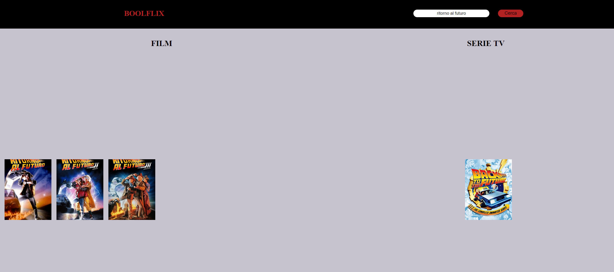
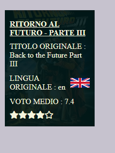

# htmlcssjs-boolflix: motore di ricerca per film e serie tv

# Obiettivo:
Utilizzando delle <b>chiamate ajax</b> e delle <b>chiavi Api</b> (https://www.themoviedb.org/?language=it-IT), creare un motore di ricerca che fornisca anche il titolo originale e la votazione media espressa in stelle.

# Utilizzo:
Semplice e intuitivo: tutto passa per la barra di ricerca.

# Ricerca
Il sito fornisce due colonne differenti in cui vengono mostrati (se presenti sia come film, che come serie tv) i risultati della ricerca.

